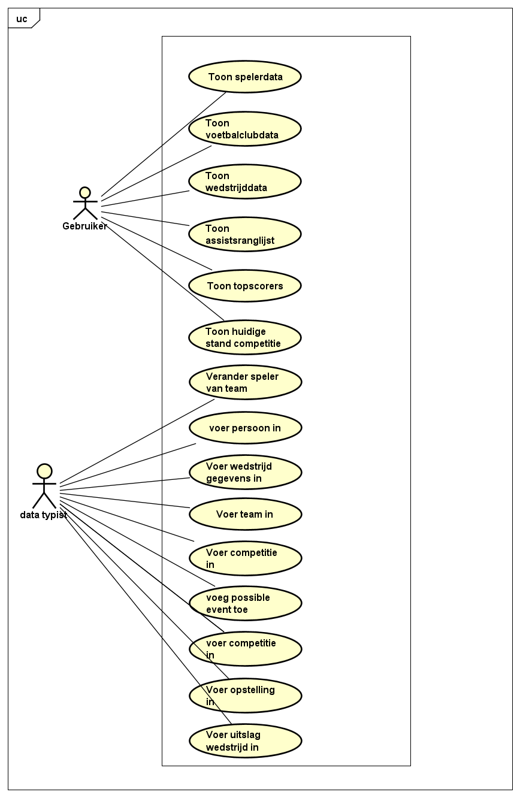
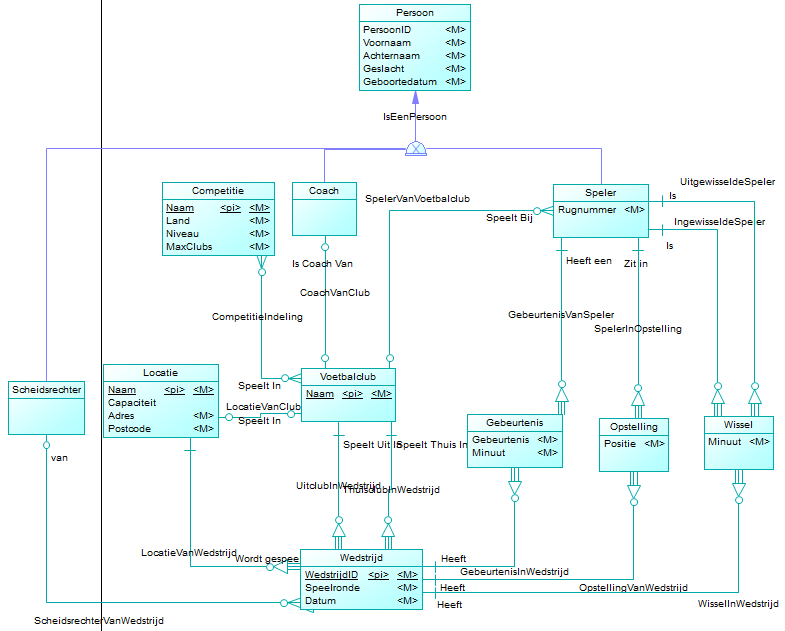

# Functioneel ontwerp
## Usecases

## Toon spelerdata
Alle gebeurtenissen die een speler ondergaat willen we in de Football League Database opslaan. Wij willen uiteindelijk van een speler handige gegevens opslaan zoals gemiddelde assists per wedstrijd, verschillende goals per wedstrijd, aantal rode kaarten, aantal rode en gele kaarten etc.

## Toon voetbalclubdata
Alle gebeurtenissen binnen een voetbalclub kunnen net als speler data ergens in de Football League Database. Hierbij zijn dan de zelfde waarden van toepassing zoals gemiddelde goals per wedstrijd, rode kaarten, gele kaarten etc.

## Toon wedstrijddata
In een wedstrijd zijn er ook veel verschillende statistieken die berekent kunnnen worden en vervolgens samen in een overzicht van alle data kunnen komen. Hierbij kan je denken aan percentage balbezit, schoten op goal, de uitslag van de wedstrijd, aantal overtredingen per voetbalclub etc.

## Toon assistranglijst
Deze spreekt grotendeels wel voorzich. Het idee hierachter is dat je een ranglijst hebt van de mensen die het meeste assists hebben gemaakt in een competitie.

## Toon topscorers
De topscorers is ongeveer hetzelfde als bij de assistranglijst, het enige verschil is dat je de mensen met de meeste goals in een lijst toont inplaatst van de mensen met de meeste assisten.

## Toon huidige stand van competitie
Als er een seizoen bezig is of af is moet het mogelijk zijn om een overzicht van deze competitie krijgt. Hierbij wil je de volgende data in het overzicht: Aantal wedstrijd gespeeld, aantal gewonnen, aantal verloren, aantal gelijkgespeeld, aantal punten, doelpunten voor, doelpunten tegen en doelsaldo.

##  Voer wedstrijd gegevens in
Hierbij vult de gebruiker de locatie,tijd,spelende teams en officials in de database van een wedstrijd die in de toekomst gespeeld gaat worden

## voer uitslag wedstrijd in
Als een wedstrijd is gespeeld kan de gebruiker de uitslag van de wedstrijd invoeren, de gebeurtenissen, de opstelling de wissels

## Voer competitie in
Als het einde van een seizoen af is kan de gebruiker een nieuwe competitie toevoegen. Hierbij vult hij alle teams van de competitie in.

## Voer team in
Als er een nieuw team in de database komt moet hij de gegevens van het team invoeren en alle spelers + coach

## Voer persoon in
Als een nieuwe coach,official of speler moet worden ingevoerd kan dat via deze usecase door alle gegevens van een speler in te voeren

## Voer opstelling in
Als de opstelling van een wedstrijd bekent is kan deze worden ingevoerd door alle spelers + posities in te voeren

## verander speler van team
Als een speler van team veranderd kun je doormiddel van deze usecase het team aanpassen en eventueel andere gegevens zoals rugnummer. 
'
## Voeg possible event toe
Als er een nieuwe event moet worden toegevoegd zoals een "blauwe kaart" kan deze worden toegevoegd via deze usecase

## CDM
### ERD
Hieronder staat de Entity Relationship Diagram voor de database zoals het op het moment ontworpen is. Dit is niet het definitieve ontwerp. De database kan en zal tijdens de verschillende iteraties in de constructie fase worden uitgebreid

Zoals te zien is in het bovenstaande ERD is er al veel data toe te voegen. Laten we beginnen met veld persoon: 
Een persoon kan worden toegevoegd met zijn/haar PersoonID, Voornaam, Achternaam, Geslacht en Geboortedatum. Een Persoon kan bestaan uit verschillende type personages; Speler, Coach en Scheidsrechter. Een Coach en Speler hebben nagenoeg dezelfde gegevens. Een speler heeft alleen ook nog een Rugnummer. Coach word gekoppelt aan VoetbalTeam, want een Team heeft een Coach, net zoals dat Speler gelinkt zit aan een Team.

Spelers zijn ook gekoppelt aan Gebeurtenis, Opstelling en Wissel. 
Met de tabellen Opstelling en Wissel kan worden gezien welke speler in de opstelling staat, maar ook waar in de opstelling (de positie die deze speler speelt) en op welk moment in een wedstrijd een speler word in- of uitgewisselt. De spelers die worden ingewisselt zullen op dat moment bankspelers zijn.

Ook kan worden gezien wanneer een bepaalde gebeurtenis zich af heeft gespeeld, zoals een gele kaart of een doelpunt. 
Dit wordt opgeslagen als Gebeurtenis, die op zijn beurt ook weer een koppeling heeft met Wedstrijd om zo een Gebeurtenis per Wedstrijd te krijgen.

Een Wedstrijd heeft een koppeling met Scheidsrechter. Ook dit is, zoals eerder gezegd, een Persoon, met als extra informatie het type scheidsrechter (Scheidsrechter, Grensrechter, etc). 
Een wedstrijd zit ook gekoppelt aan een Locatie, waar de wedstrijd zich afspeelt. Deze bevat een naam, een Capaciteit van bezoekers, een Adres en een Postcode. 

Beiden Wedstrijd en Locatie zitten verbonden aan een Voetbalteam. 
Hierdoor kan er bijvoorbeeld worden aangegeven dat een Team zich bevind op locatie "X" en de wedstrijd plaats vind op locatie "Y". 

Als laatst zitten voetbalteams gelinkt aan Competitie, dus welke Teams zitten in welke competitie. Deze bevat een Naam, Land, Niveau en het maximaal aantal Clubs voor die specifieke competitie.

Het is nog niet mogelijk om zogenaamde knock-out competities toe te voegen aan de database, de bedoeling is om dit toe te voegen in een latere iteratie. Ook wordt er in de eerste iteratie nog geen rekening houden dat clubs kunnen degraderen naar een 'lagere competitie.'
### Constraints
C1 - MaxVoetbalClubsPerCompetitie  
Concerns: ET Competitie, ET Voetbalclub, Att MaxClubs  
Specificatie: De koppeltabel die komt tussen competitie en voetbalclub gaat de voetbalclubs bijhouden per competitie. Hierin komt een constraint dat er niet meer clubs dan het attribuut MaxClubs in kunnen komen.  

C2 - RugnummerPerClub  
Concerns: ET Speler, Att Rugnummer  
Specificatie: Binnen een team kunnen er niet twee spelers zijn die hetzelfde rugnummer hebben  

C3 - AantalSpelersPerOpstelling  
Concerns: ET Opstelling  
Specificatie: Er mogen maximaal 11 spelers per wedstrijd per team in de opstelling staan, en niet minder dan 7 per wedstrijd per team.  

C4 - WisselVanBasisspeler  
Concerns: ET Wissel  
Specificatie: Een speler moet in de opstelling staan of ingewisseld zijn als hij uit wordt gewisseld.  

C5 - WisselVanBankspeler  
Concerns: ET Wissel  
Specificatie: Een speler mag niet in het veld staan als hij in wordt gewisseld  

C6 - NaamVanGebeurtenis  
Concerns: Et Gebeurtenis, Att Gebeurtenis  
Specificatie: Een gebeurtenis mag alleen bepaalde waardes bevatten (Gele kaart, Rode kaart, Goal, Vrije Trap etc.)  

C7 - VoetbalclubTegenZichzelf  
Concerns: ET Wedstrijd, ET Voetbalclub  
Specificatie: Een voetbalclub kan niet tegen zichzelf spelen.  

C8 - EenWedstrijdPerSpeelronde  
Concerns: ET Wedstrijd, ET Voetbalclub  
Specificatie: Een voetbalclub mag maar een wedstrijd spelen per speelronde.  

C9 - EenWedstrijdPerVoetbalclub  
Concerns: ET Wedstrijd, ET Voetbalclub, Att Datum  
Specificatie: Een voetbalclub moet niet twee wedstrijden tegelijkertijd kunnen spelen.  

C10 - EenWedstrijdPerLocatie  
Concerns: ET Wedstrijd, ET Locatie  
Specificatie: Er mag maar een wedstrijd tegelijkertijd worden gespeeld op een locatie  

### Domeinen
| Entiteit      | Domein        | Datatype      | Waarde Beperkingen |
|---------------|---------------|---------------|--------------------|
| Competitie    | Naam          | VARCHAR(255)  |
|               | Land          | VARCHAR(255)  |
|               | Niveau        | NUMERIC(1)    | value > 0          |
|               | MaxClubs      | NUMERIC(2)    | value > 0          |
| Voetbalclub   | Naam          | VARCHAR(255)  |
| Locatie       | Naam          | VARCHAR(255)  |
|               | Capaciteit    | NUMERIC(6)    | value > 0          |
|               | Adres         | VARCHAR(255)  |
|               | Postcode      | VARCHAR(10)   |
| Wedstrijd     | WedstrijdID   | NUMERIC(6)    | value > 0          |
|               | Speelronde    | NUMERIC(2)    | value > 0          |
|               | Datum         | DATE          |
| Gebeurtenis   | Gebeurtenis   | VARCHAR(255)  |
|               | Tijd          | TIME          |
| Opstelling    | Positie       | VARCHAR(25)   |
| Wissel        | Tijd          | TIME          |
| Persoon       | PersoonID     | NUMERIC(6)    | value > 0          |
|               | Voornaam      | VARCHAR(255)  |
|               | Achternaam    | VARCHAR(255)  |
|               | Geslacht      | VARCHAR(1)    | value = 'M','V','O'|
| Speler        | Rugnummer     | Numeric(2)    | value > 0 & < 100  |

### Overige Besluiten
Locatie gegevens:  
Er is een mogelijkheid dat een club niet op eigen locatie kan spelen. Hierdoor hebben we een locatie aan club gekoppeld, maar ook nog een locatie aan een wedstrijd gekoppeld. Hierdoor zou je de locatie van een wedstrijd kunnen aanpassen als het nodig is.

Geen uitslag attribuut:  
Omdat we alle gebeurtenissen bijhouden kunnen we vanuit daar berekenen per wedstrijd wat de uitslag is en hoeft deze niet opgeslagen te worden.

## CRUD Matrix
De CRUD Matrix ligt toe wat de verschillende rollen binnen de database zijn en wat individuele rollen met individuele tabellen kunnen doen.

| Rol   | Speler | Coach | Competitie | Scheidsrechter | Locatie | Voetbalclub | Gebeurtenis | Opstelling | Wissel | Wedstrijd |
|---------------|-------|------------|----------------|---------|-------------|-------------|------------|--------|----------|--------|
| Toon topscoorders | read   |    |   |       |       |   | read        |      |      |
| Toon spelerdata | read   |    |  read |       |       |  read | read        |   read   |      |read

### Testplan
Review van Functioneel Ontwerp en Technisch Ontwerp.

Productietest aan het einde van elke constructie iteratie.

Stresstest via het testen van de database met een enorme hoeveelheid data. (MSSQL naar MongoDB)

Unittest van Stored Procedure's en Trigger's.

Regressietest door de casus op een nieuwe PC te installeren.
