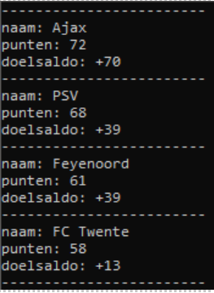

# Onderzoeksverslag voorbeelddata
## ISE-PROJECT GROEP B2

 **Auteurs:** Sietse Noordbruis (581905) en Wijnand van Zyl (655269)

 **Datum:** 26-04-22

 **Versie:** 1.1
 
 **Docent:** Michel Koolwaaij **•** Frank Tempelman **•** Helen Visser
 
 # Inhoudsopgave
```
1. Inleiding
2. Onderzoeksvragen
2.1 Wat zijn de opties om aan voorbeelddata te komen?
2.2 Kunnen wij gegevens genereren aan de hand van bestaande API'S?
2.3 Kunnen wij gegevens genereren aan de hand van een scraper?
2.4 Kunnen wij gegevens zelf genereren?
2.5 Is het handmatig invullen van gegevens een optie?
3. Conclusie
4.Bibliografie
```

# Inleiding
Omdat we voorbeelddata nodig hebben om de database een beetje te vullen en om hem te testen moeten we hier een efficiënte manier voor vinden. Daarom gaan we hier onderzoek naar doen. Bij dit onderzoek hoort een hoofdvraag. Omdat dit document bedoeld is om een efficiënte manier om aan voorbeelddata te komen hebben we de hoofdvraag verzonnen: Wat is de meest efficiënte manier om aan voorbeelddata te komen voor de “Football League Manager"? Deze vraag gaan we beantwoorden door een aantal deelvragen deze deelvragen gaan als volgt: 
- Wat zijn de opties om aan voorbeelddata te komen? 
- Kunnen wij de voorbeeldgegevens genereren aan de hand van een bestaande API? 
- Kunnen wij de voorbeeldgegevens genereren aan de hand van een scraper? 
- Kunnen wij gegevens zelf genereren? 
- Is het handmatig invullen van gegevens een optie? 

Als we deze vragen beantwoord zijn kunnen we antwoord geven op de hoofdvraag in de conclusie. En hebben we het doel van het document behaald.

 

# Onderzoeksvragen
In dit hoofdstuk zullen we de deelvragen van dit document beantwoorden.

## Wat zijn de opties om aan voorbeelddata te komen?

Door een beetje te zoeken op het internet en zelf te brainstormen hebben wij de volgende opties gevonden:

- API 

- Scraper 

- Data genereren 

- Handmatig invoeren 

Deze 4 opties zullen we nu kort toelichten.

API:

Een API (application programming interface) is set regels om computers of applicaties met elkaar te laten communiceren. Hiermee moet het mogelijk zijn om een gegevens vanuit een applicatie te halen of op te slaan met een andere applicatie. Vaak zijn deze API’s beveiligd en soms is het nodig om voor het gebruik te betalen.

 

Scraper:

Een scraper is een bot of een script die allemaal informatie kan trekken uit een html pagina. Je kan zelf aangegeven welke site jij wilt scrapen en kan vervolgens zeggen dat je de informatie nodig hebt uit bepaalde html classes die in een element verstopt zijn. Deze informatie kun je converteren naar bijvoorbeeld een Excel bestand maar je kan hem ook gewoon als een variabele opslaan die je vervolgens in de database stopt. 


Data genereren: 

Als echte gegevens niet betrouwbaar opgehaald kunnen worden, dan is het altijd nog een optie om het zelf te verzinnen. Dit echter is veel werk en zal lang duren. Een betere idee zal dan zijn om de gegevens te laten genereren met een script. 

Handmatig invoeren: 

Als laatste ‘’redmiddel’’ hebben we bedacht om handmatig gegevens in te voeren. Als dit het geval is gaan we zelf insert scripts schrijven met voorbeelddata voor de database. 

## Kunnen wij de voorbeeldgegevens genereren aan de hand van een bestaande API?

Er zijn een aantal verschillende API's die de benodigde voetbalgegevens beschikbaar stellen. We gaan een aantal met elkaar vergelijken om te zien welke het meeste geschikt is om te dienen als bron voor voorbeelddata. Er wordt gekeken naar de aanbod van competities en het maximum aantal calls. Ook worden opvallende gegevens die beschikbaar zijn in de API genoteerd. Deze gegevens zijn voor de gratis editie van de API's.

|Naam             |Website                                    |Competities                                                                  |Call limiet      |Gegevens Beschikbaar|
|-----------------|-------------------------------------------|----------------------------------------------------------------------------------|-----------------|--------------------|
|API-football     |https://www.api-football.com               |910 Leagues & Cups<br>O.A. Eredivisie<br>Eredivisie Women<br>KNVB Beker World Cup |100 calls / dag  |Wedstrijd statistieken<br>Coaches<br>Lineups|
|Sports-monk      |https://www.sportmonks.com/football-api    |Danish Superliga<br>Scottish Premiership                                          |180 calls / uur  |Wedstrijd statistieken<br>Stadion Capaciteit<br>Afbeeldingen|
|APIFootball      |https://apifootball.com/                   |O.A. Eredivisie<br>Eredivisie Women<br>KNVB Beker<br>World Cup                    |180 calls / uur  |Wedstrijd statistieken<br>Lineups|
|Soccer’s api     |https://soccersapi.com/                    |A-League<br>Superliga<br>Austrian Bundesliga                                      |100 calls / uur  |Wedstrijd statistieken<br>Coaches<br>Stadion Capaciteit|
|Football data    |https://www.football-data.org              |12 Totaal<br>O.A. Eredivisie<br>Champions League<br>World Cup                      |10 calls / minuut|Geen benoemenswaardige data|

Hoewel er verschillen tussen de API's zijn. Van alle API's die de Eredivisie aanbieden, is er één die niet alle benodigde gegevens beschikbaar stelt.
Enkel "APIFootball" en "API-football" zijn qua data eventueel geschikt. Alle api's hebben echter het limiet van een maximaal aantal calls. Dit limiet zorgt er voor dat het ophalen van de gegevens traag gaat. Hier tegenover staat wel dat de gegevens simpel op te halen zijn en dat we gegarandeerd zijn dat de data realistisch is.


## Kunnen wij de voorbeeldgegevens genereren aan de hand van een scraper?
Experiment: Om te kijken hoe ingewikkeld het is om informatie te scrapen over de eredivisie hebben we een eenvoudige scraper gebouwd die de namen van de clubs, het aantal punten en het doelsaldo ophalen van alle teams uit de eredivisie deze implementatie ziet er als volgt uit: 
  <Br>
Bovenaan de script kies ik de website uit die ik wil scrapen. Voor dit voorbeeld maak ik gebruik van de officiële eredivisie site. Vervolgens haal ik de html pagina op en filter ik alle teams eruit door te zoeken op de tr tag die het attribuut ‘’data-clubs’’ bevat. Het resultaat hiervan stop ik in de array allTeams. Ik maak vervolgens een for each loop en zoek voor team de naam, het aantal punten en de doelsaldo. De informatie haal ik op als dezelfde manier als alle teams alleen pas ik de tags of attributen aan naar de locatie van de benodigde informatie. Vervolgens print ik de informatie uit. Als ik het script uitvoer krijg ik het volgende resultaat: 

 
 
Dit zijn de eerste 4 resultaten. Deze informatie kunnen we dus nu in de database stoppen maar omdat er tijdens het maken van dit document nog geen database gerealiseerd is kunnen we dat niet laten zien. Het is dus wel mogelijk om data te scrapen op een relatief makkelijke manier. 

### Voordelen:  

- Je kan in principe aan alle informatie komen die je nodig hebt als je de website er maar voor vindt. Je kan dus bijvoorbeeld ook meerdere leagues van verschillende landen gemakkelijk toevoegen. voorbeeld(https://www.goal.com/nl/alle-competities)

- Omdat je het zelf maakt is het gratis en kan zo vaak worden gebruikt als je maar wilt.

- Als je het script af hebt gaat alles automatisch, je hoeft hem alleen maar te runnen en hij scraped alle data en stopt het in de database.

- Als je plaatjes of video’s nodig hebt kun je deze ook scrapen van de pagina.

### Nadelen: 

- Als de site van structuur veranderd moet je de code ook aanpassen.

- Als je gebruik gaat maken van ingewikkelde scrapers is er een kans dat de verbinding van je huidige ip-adres wordt geweigerd op bepaalde websites waardoor je meestal een dag moert wachten voordat je weer verder kan met scrapen.

## Kunnen wij gegevens zelf genereren?
Als het niet lukt om werkelijke gegevens uit een database te halen is het altijd nog een optie om deze gegevens (grotendeels) zelf te genereren. Door gegevens te genereren is er geen afhankelijkheid van derde partijen, terwijl het toch mogelijk is om in een korte tijd veel data bij elkaar te krijgen.
Een nadeel hiervan is dat het moeilijker wordt om geldigheid van de data te garanderen: Het is met het genereren van de data mogelijk dat er situaties worden gecreëerd die in werkelijk niet voor kunnen komen, of situaties die zelden zijn, vaker voorkomen dan in werkelijkheid.

Voor het genereren van de data is wel wat basis data nodig zoals een lijst van teamnamen, voor- en achternamen. Het koppelen van stadions aan voetbalclubs zou waarschijnlijk nog het meeste werk kosten, aangezien dit namen, en adressen bevat.

## Is het handmatig invullen van gegevens een optie? 

Het handmatig invullen van de gegevens zien we meer als een laatste redmiddel en zullen we dus ook alleen gebruiken als geen van de andere opties werkt. Een voorbeeld hiervan ziet er als volgt uit: 

```
INSERT INTO VOETBALCLUB  

VALUES('AJAX','Hendrik jan','Eredivisie','Amsterdam Arena'), 

('Feyenoord','Melvin','Eredivisie','De Kuip'), 

('Graafschap','Erik','Keukenkampioenschap','Vijverberg') 
```
 

Als je een beetje een grote populatie wilt hebben kost dit enorm veel tijd en wat bijna de moeite niet waard is. Als er dus om een of andere reden de vorige opties op geen enkele manier mogelijk is zullen we gebruik moeten maken van het handmatig invullen van gegevens. We deze optie dus ook niet overwegen in de conclusie.

# Conclusie
Het ophalen van de gegevens via een API is mogelijk, maar het ophalen zal veel tijd kosten en zal ongeveer even veel werk worden als gegevens halen via een scraper.
Het genereren van de gegevens is een optie, maar omdat het niet mogelijk is om op deze manier te garanderen dat de data realistisch heeft dit niet de voorkeur.
Gegevens zelf typen is een mogelijkheid die erg veel arbeid vereist. Dit betekent dat ontwikkelaars bezig zijn om de gegevens handmatig de gegevens in te voeren terwijl ze bezig moeten zijn met het ontwikkelen van het project.

Het uiteindelijke keuze valt dus op het gebruiken van een scraper. Het zal ongeveer net zoveel tijd kosten om te ontwikkelen, maar haalt de gegevens sneller op dan een API (Omdat het geen snelheid-limiet heeft), en is preciezer dan gegevens willekeurig genereren.

# Bibliografie
IBM Cloud Education. (2020, 19 augustus). Application Programming Interface (API). Geraadpleegd op 25 april 2022, van https://www.ibm.com/cloud/learn/api
Perez, M. (2021, 1 augustus). What is Web Scraping and What is it Used For? Geraadpleegd op 25 april 2022, van https://www.parsehub.com/blog/what-is-web-scraping/
Phoenix, J. (2020, 4 februari). The Advantages & Disadvantages of Web Scraping Data. Geraadpleegd op 25 april 2022, van https://understandingdata.com/the-advantages-disadvantages-of-web-scraping-data/
Stand. (z.d.). Geraadpleegd op 25 april 2022, van https://eredivisie.nl/competitie/stand/