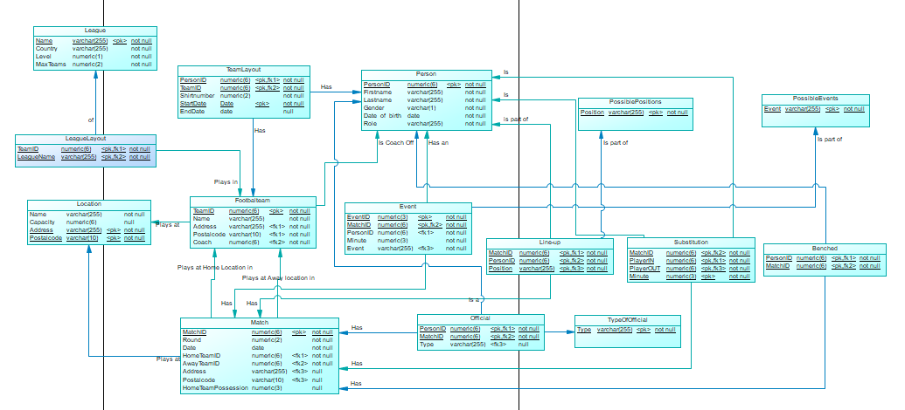

## Systeem en software architectuur

# PDM

# Fysiek database schema

| Tabel: League      | Behoud de gegevens van een competitie                                 | Domains      | Primary Key | Foreign Key     | Constraints                                    |
|--------------------|-----------------------------------------------------------------------|--------------|-------------|-----------------|------------------------------------------------|
| Kolom              | Beschrijving                                                          |              |             |                 |                                                |
| Name               | De naam van een competitie                                            | Varchar(255) | X           | -               | Not null                                       |
| Country            | Het land waarin de competitie wordt gespeeld                          | Varchar(255) | X           | -               | Not null                                       |
| Level              | Nummer van het Niveau van de competitie (1 is hoogste niveau)         | Numeric(1)   | -           | -               | Not null                                       |
| MaxTeams           | Nummer van hoeveel Teams er maximaal in deze competitie mogen meedoen | Numeric(2)   | -           | -               | Not null                                       |

| Tabel: LeagueLayout| Behoud de gegevens van een competitie opstelling                      | Domains      | Primary Key | Foreign Key     | Constraints                                    |
|--------------------|-----------------------------------------------------------------------|--------------|-------------|-----------------|------------------------------------------------|
| League             | De naam van een competitie                                            | Varchar(255) | X           | X - League      | Not null                                       |
| TeamID         | Het ID van een voetbalTeam                                           | Numeric(6) | X           | X - FootbalTeam  | Not null                                       |

| Tabel: FootbalTeam | Behoud de gegevens van een voetbalTeam                                | Domains      | Primary Key | Foreign Key     | Constraints                                    |
|--------------------|-----------------------------------------------------------------------|--------------|-------------|-----------------|------------------------------------------------|
| TeamID             | Het ID van een voetbalTeam                                           | Numeric(6)   | X           | -               | Not null                                       |
| Name               | De naam van een voetbalTeam                                           | Varchar(255) | X           | -               | Not null                                       |
| Adress             | Het adres van een locatie                                             | Varchar(255) | X           | X - Location    | Not null                                               |
| Coach              | De coach van een voetbalTeam                                          | Varchar(255) | -           | X - Person      | Not null                                                 |
| Postalcode         | De postcode van een voetbalTeam                                       | Varchar(255) | X           | X - Location    | Not null                                               |

| Tabel: Teamlayout  | Behoud de gegevens van de spelers van een voetbalTeam                 | Domains      | Primary Key | Foreign Key     | Constraints                                    |
|--------------------|-----------------------------------------------------------------------|--------------|-------------|-----------------|------------------------------------------------|
| TeamID             | Het ID van een voetbalTeam                                           | Numeric(6)   | X           | -               | Not null                                       |
| PersonID           | Het unieke ID van een persoon                                         | Numeric(6)   | X           | X - Person      | Not null, Unique                               |
| Shirtnumber        | Het rugnummer van een persoon met een speler rol                      | Numeric(2)   | -           | -               | Not Null                                               |
| Startdate          | Het rugnummer van een persoon met een speler rol                      | Date         | X           | -               | Not Null                                               |
| Enddate            | Het rugnummer van een persoon met een speler rol                      | Date         | -           | -               |                                                  |

| Tabel: Location    | Behoud de gegevens van een locatie                                    | Domains      | Primary Key | Foreign Key     | Constraints                                    |
|--------------------|-----------------------------------------------------------------------|--------------|-------------|-----------------|------------------------------------------------|
| Name               | De naam van een locatie                                               | Varchar(255) | -           | -               | Not null                                       |
| Capacity           | De capaciteit van de locatie van toeschouwers                         | Numeric(6)   | -           | -               |                                          |
| Address             | Het adres van de locatie                                              | Varchar(255) | X           | -               | Not null                                       |
| Postalcode         | De postcode van de locatie                                            | Varchar(10)  | X           | -               | Not null                                       |

| Tabel: Match        | Behoud de gegevens van een wedstrijd                                  | Domains      | Primary Key | Foreign Key     | Constraints                                    |
|--------------------|-----------------------------------------------------------------------|--------------|-------------|-----------------|------------------------------------------------|
| MatchID             | Het unieke ID van een wedstrijd                                       | Numeric(6)   | X           | -               | Not null, Unique                               |
| Round              | De huidige speelronde waarin de wedstrijd zich bevindt                | Numeric(2)   | -           | -               | Not null                                       |
| Date               | De datum waarop de wedstrijd afspeelt                                 | Date         | -           | -               | Not null     
| HomeTeamID           | Het ID van de voetbalTeam die thuis speelt                                       | Numeric(6) | -           | -               | Not null                                       |
| AwayTeamID           | Het ID van de voetbalTeam die uit speelt                                         | Numeric(6) | -           | -               | Not null                                       |
| Address             | Het adres van de locatie                                              | Varchar(255) | -           | X - Location    | Not null                                       |
| Postalcode         | De postcode van de locatie                                            | Varchar(10)  | -           | X - Location    | Not null                                       |
| HomeTeamPossesion         | Het balbezit van het thuis team                                            | Numeric(3)  | -           | -    |                                        |

| Tabel: Event       | Behoud de gegevens van een Gebeurtenis                                | Domains      | Primary Key | Foreign Key     | Constraints                                    |
|--------------------|-----------------------------------------------------------------------|--------------|-------------|-----------------|------------------------------------------------|
| Event              | De gebeurtenis die kan voorkomen                                      | Varchar(255) | X           | X - PossibleEvents               | Not null                                       |
| Time               | De tijd wanneer een gebeurtenis voorkomt                              | Time         | X           | -               | Not null                                       |
| PersonID           | Het unieke ID van een persoon                                         | Numeric(6)   | X           | X - Person      | Not null, Unique                               |
| MatchID             | Het unieke ID van een Wedstrijd                                       | Numeric(6)   | X           | X - Match        | Not null, Unique                               |

| Tabel: Line-up     | Behoud de gegevens van een opstelling                                 | Domains      | Primary Key | Foreign Key     | Constraints                                    |
|--------------------|-----------------------------------------------------------------------|--------------|-------------|-----------------|------------------------------------------------|
| Position           | De positie van een speler binnen een wedstrijd                        | Varchar(25)  | X           | X - PossiblePositions               | Not null                                       |
| PersonID           | Het unieke ID van een persoon                                         | Numeric(6)   | X           | X - Person      | Not null, Unique                               |
| MatchID             | Het unieke ID van een wedstrijd                                       | Numeric(6)   | X           | X - Match        | Not null, Unique                               |

| Tabel: Official     | Behoud de gegevens van een scheidsrechter                             | Domains      | Primary Key | Foreign Key     | Constraints                                    |
|--------------------|-----------------------------------------------------------------------|--------------|-------------|-----------------|------------------------------------------------|
| PersonID           | Het unieke ID van een persoon                                         | Numeric(6)   | X           | X - Person      | Not null, Unique                               |
| MatchID             | Het unieke ID van een wedstrijd                                       | Numeric(6)   | X           | X - Match        | Not null, Unique                               |
| Type               | Het type scheidsrechter                                               | Varchar(25)  | -           | -               | Not null                                       |

| Tabel: Substitution| Behoud de gegevens van een wissel actie                               | Domains      | Primary Key | Foreign Key     | Constraints                                    |
|--------------------|-----------------------------------------------------------------------|--------------|-------------|-----------------|------------------------------------------------|
| Minute               | De tijd waarop een wissel wordt uitgevoerd                            | Numeric(3)   | X           | -               | Not null                                       |
| PersonID           | Het unieke ID van een persoon                                         | Numeric(6)   | X           | X - Person      | Not null, Unique                               |
| MatchID             | Het unieke ID van een wedstrijd                                       | Numeric(6)   | X           | X - Match        | Not null, Unique                               |

| Tabel: Benched| Behoud de gegevens van spelers op de bank                               | Domains      | Primary Key | Foreign Key     | Constraints                                    |
|--------------------|-----------------------------------------------------------------------|--------------|-------------|-----------------|------------------------------------------------|
| PersonID           | Het unieke ID van een persoon                                         | Numeric(6)   | X           | X - Person      | Not null, Unique                               |
| MatchID             | Het unieke ID van een wedstrijd                                       | Numeric(6)   | X           | X - Match        | Not null, Unique                               |

| Tabel: PossiblePositions| Behoud de gegevens van mogelijke posities                           | Domains      | Primary Key | Foreign Key     | Constraints                                    |
|--------------------|-----------------------------------------------------------------------|--------------|-------------|-----------------|------------------------------------------------|
| Position           | De unieke Positie naam                                         | Numeric(6)   | X           | -   | Not null, Unique                               |

| Tabel: PossibleEvents| Behoud de gegevens van mogelijke posities                           | Domains      | Primary Key | Foreign Key     | Constraints                                    |
|--------------------|-----------------------------------------------------------------------|--------------|-------------|-----------------|------------------------------------------------|
| Event           | De unieke Gebeurtenis naam                                         | Numeric(6)   | X           | -   | Not null, Unique                               |

| Tabel: TypeOfOfficial| Behoud de gegevens van mogelijke posities                           | Domains      | Primary Key | Foreign Key     | Constraints                                    |
|--------------------|-----------------------------------------------------------------------|--------------|-------------|-----------------|------------------------------------------------|
| Type           | De unieke naam van een Type scheidsrechter                                        | Numeric(6)   | X           | -   | Not null, Unique                               |

| Tabel: Person      | Behoud de gegevens van een speler                                     | Domains      | Primary Key | Foreign Key     | Constraints                                    |
|--------------------|-----------------------------------------------------------------------|--------------|-------------|-----------------|------------------------------------------------|
| PersonID           | Het unieke ID van een persoon                                         | Numeric(6)   | X           | -               | Not null, Unique                               |
| Firstname          | De voornaam van een persoon                                           | Varchar(255) | -           | -               | Not null                                       |
| Lastname           | De achternaam van een persoon                                         | Varchar(255) | -           | -               | Not null                                       |
| Gender             | Het geslacht van een persoon                                          | Varchar(255) | -           | -               | Not null                                       |
| Date_of_birth      | De geboortedatum van een persoon                                      | Date         | -           | -               | Not null                                       |
| Role               | De rol van een persoon                                                | Varchar(255) | -           | -               | Not null, Check(scheidsrechter, speler, coach) |

# Views
VR1 correspondeert met V1 - GebeurtenisVanSpelerBinnenWedstrijd  
Specificatie: Geeft een lijst terug van alle spelers die een gebeurtenis hebben gehad binnen een wedstrijd.  
Implementatie: Create VIEW van een overzicht van alle gebeurtenissen van alle spelers over elke wedstrijd.

VR2 correspondeert met V2 - VoetbalGegevensBinnenCompetitie  
Specificatie: Geeft een lijst van Voetbalclubs met Goals, Tegen Goals en Gewonnen, Verloren of Gelijk gespeelde wedstrijden en uiteindelijk hoeveelheid punten per competitie.
Implementatie: Create VIEW van een overzicht van Goals, Tegen Goals, Gewonnen, Verloren, Gelijkgespeelde en punten van elke voetbalclub over elke competitie.

VR3 correspondeert met V3 - EindstandWedstrijd  
Specificatie: Geeft een lijst terug met de goals die in een wedstrijd zijn gemaakt door spelers van een voetbalclub.
Implementatie: Create VIEW die een lijst terug van alle gebeurtenissen die tellen als doelpunt en geef bij deze lijst wie het doelpunt heeft gemaakt.

VR4 correspondeert met V4 - WisselSpelersInDeWedstrijd
Specificatie: Geeft een lijst terug van alle spelers die een wissel hebben gemaakt binnen een wedstrijd.
Implementatie: Create VIEW van een overzicht van alle spelers die een wissel hebben uitgevoerd over elke wedstrijd.

VR5 correspondeert met V5 - AantalWedstrijdenDieEenVoetbalclubHeeftGespeeld
Specificatie: Geeft een lijst terug van de hoeveelheid wedstrijden dat een Voetbalclub heeft gespeeld.
Implementatie: Create VIEW van een overzicht van alle wedstrijden waarin een voetbalclub heeft gespeeld.

VR6 correspondeert met V6 - WedstrijdPerLocatie
Specificatie: Geeft een lijst terug van hoeveel wedstrijden er per locatie zijn geweest.
Implementatie: Create VIEW van een overzicht van alle wedstrijden die er gespeeld zijn per locatie.

VR7 correspondeert met V7 - OpstellingVanSpelers
Specificatie: Geeft een lijst terug van hoeveel keer een speler een specifieke opstelling plek heeft gehad.
Implementatie: Create VIEW van een overzicht van welke opstellingen een speler heeft gehad over elke speler.

# Integrity rules
IR1 correspondeert met C1 MaxVoetbalTeamsPerCompetitie  
Specificatie: De koppeltabel die komt tussen competitie en voetbalTeam gaat de voetbalTeams bijhouden per competitie. Hierin komt een constraint dat er niet meer Teams dan het attribuut MaxTeams in kunnen komen.  
Implementatie: Insert trigger TRIGGER_MAXIMUMTEAMS op de tabel

IR2 correspondeert met C2 RugnummerPerTeam  
Specificatie: Binnen een team kunnen er niet twee spelers zijn die hetzelfde rugnummer hebben  
Implementatie: Met een insert/update trigger TRIGGER_CHECKFORDUPLICATE op de tabel

IR3 correspondeert met C3 AantalSpelersPerOpstelling  
Specificatie: Er mogen maximaal 11 spelers per wedstrijd per team in de opstelling staan, en niet minder dan 7 per wedstrijd per team.  
Implementatie: Check-Constraint CHECK_MAXSPELERS op de tabel

IR4 correspondeert met C4 WisselVanBasisspeler  
Specificatie: Een speler moet in de opstelling staan of ingewisseld zijn als hij uit wordt gewisseld.  
Implementatie: Insert/update/delete trigger TRIGGER_CHECKIFAVAILABLESWAP

IR5 correspondeert met C5WisselVanBankspeler  
Specificatie: Een speler mag niet in het veld staan als hij in wordt gewisseld  
Implementatie: Insert/Update/Delete trigger TRIGGER_CHECKIFNOACTIVE

IR6 correspondeert met C6 NaamVanGebeurtenis  
Specificatie: Een gebeurtenis mag alleen bepaalde waardes bevatten (Gele kaart, Rode kaart, Goal, Vrije Trap etc.)  
Implementatie: Check-Constraint CHECK_SETVALUESINEVENT

IR7 correspondeert met C7 VoetbalTeamTegenZichzelf  
Specificatie: Een voetbalTeam kan niet tegen zichzelf spelen.  
Implementatie: Check-Constraint CHECK_CONTESTNOTAGAINSTITSELF

IR8 correspondeert met C8  EenWedstrijdPerSpeelronde  
Specificatie: Een voetbalTeam mag maar een wedstrijd spelen per speelronde.  
Implementatie: Check-Constraint CHECK_ONLYONEGAMEPERROUND

IR9 correspondeert met C9 EenWedstrijdPerVoetbaTeam  
Specificatie: Een voetbalTeam moet niet twee wedstrijden tegelijkertijd kunnen spelen.  
Implementatie: Insert/Update trigger TRIGGER_CHECKIFAVAILABLETIME

IR10 correspondeert met C10 EenWedstrijdPerLocatie  
Specificatie: Er mag maar een wedstrijd tegelijkertijd worden gespeeld op een locatie  
Implementatie: Insert/Update trigger TRIGGER_AVAILABLESPOTATLOCATIONANDTIME

# Implementatie Keuzes
**ID bij Match**  
Bij de tabel *Match* is ervoor gekozen om een id nummer te gebruiken als primary key. Deze keuze is gemaakt om de data base te versimpelen: Zonder een id zou de tabel een primary key hebben die over 5 kolommen heen gaat (Round, Date, AwayTeam, HomeTeam, Location). Om te voorkomen dat in tabellen die verwijzen naar deze tabel al deze kolommen moeten worden geplaatst, is er vanwege deze hoge hoeveelheid kolommen die zonder een id de primary key zouden vormen, ervoor gekozen om dit met een id te doen.

**ID bij Person**  
Het is zeker niet ongehoord dat 2 mensen dezelfde voor en achter naam hebben. Hoewel de kans klein is dat 2 mensen met de zelfde naam op top-niveau voetballen en dan zelfs ook op dezelfde datum zijn geboren, is het wel mogelijk. Daarom is er voor gekozen om, net als bij het Burgerservicenummer, een ID nummer te gebruiken als primary key bij de tabel *person*.

**ID bij Event**  
Omdat wij de tijden van een gebeurtenis in de minuten van een wedstrijd zullen opslaan kan er een mogelijkheid ontstaan waarin een zelfde gebeurtenis met dezelfde speler twee keer in een minuut kan voorkomen (Denk aan twee gele kaarten op dezelfde speler). Vanwege deze reden is er voor gekozen een nummer te gebruiken als primary key plus het wedstrijd id.

**Een tabel voor Person**   We gaan Spelers, Coach en scheidsrechters opslaan. Deze zijn allemaal Personen. Vanwege deze reden gaan we een enkele persoon tabel aanmaken waarin alle algemene gegevens van een persoon in staan. Hierin kunnen afwijkingen komen zoals rugnummer bij een speler.7

**Bank Spelers**  
Een voetbalTeam kan normaal een aantal spelers op de bank naar een wedstrijd meenemen. Deze spelers zijn bedoelt om gebruikt te worden tijdens wissels. Om deze spelers op te slaan is er een nieuwe tabel aangemaakt met de personen die op de bank zitten tijdens een bepaalde wedstrijd.

**PossiblePositions en PossibleEvents**  
Huidige posities en Gebeurtenissen zullen in een aparte tabel worden opgeslagen. Deze lijsten worden gebruikt binnen Line-up en Event als PK en FK. Dit zorgt voor de mogelijkheid om eventuele posities en/of gebeurtenissen toe te voegen, aan te passen of te verwijderen.

# Test Plan
Review:

Via een afspraak is er een Review gepland op het Functionele ontwerp en het technische ontwerp. Deze zullen door de Opdrachtgever bekeken worden en eventueel feedback geven.

Productietest:

Aan het einde van elke constructie iteratie zal er een 'sprint review' plaatsvinden. Hierin zal de opdrachtgever een demonstratie krijgen die tegelijkertijd als productietest zal dienen.

Stresstest:

Via een stored procedure die een enorme hoeveelheid data zal creëren wordt er gekeken of de link tussen MSSQL, MongoDB en de API goed functioneren met deze hoeveelheid data.

Unittest:

Er zal een test-database versie worden aangemaakt waarin tSQLt wordt geactiveerd. Hierin zullen verschillende stored procedures worden aangemaakt om de bestaande triggers en procedures te testen.

Regressietest:

Er zal een tutorial worden aangemaakt om dit project volledig te installeren. Dit zal worden uitgevoerd op een andere computer, met de database nog niet geïnstalleerd, waarin wordt gekeken of na het installeren alles werk zoals het zou moeten.